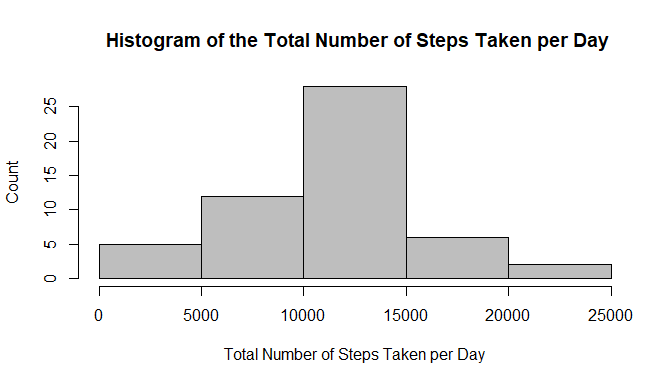
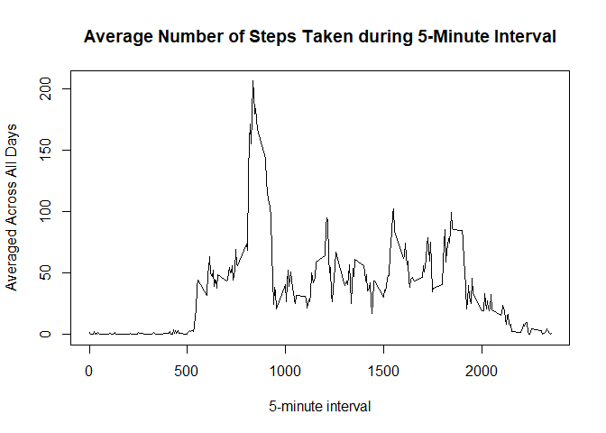
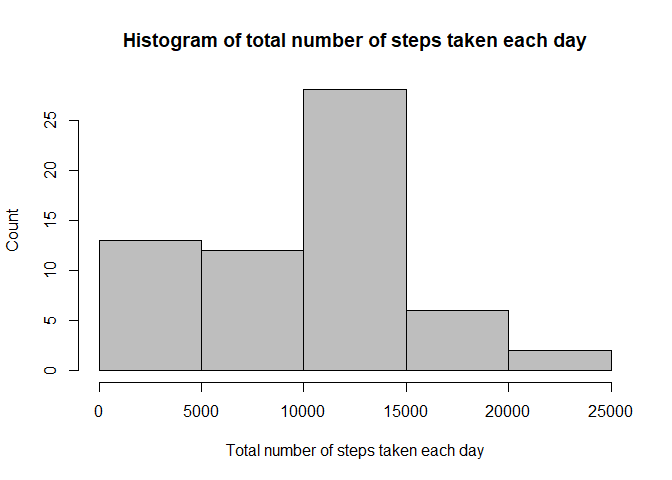
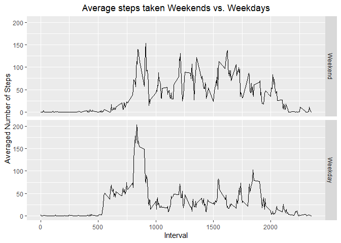

```
## Warning: package 'dplyr' was built under R version 3.5.3
```

```
## 
## Attaching package: 'dplyr'
```

```
## The following objects are masked from 'package:stats':
## 
##     filter, lag
```

```
## The following objects are masked from 'package:base':
## 
##     intersect, setdiff, setequal, union
```

## Dowloading and unzipping data from website

```r
url <- "https://d396qusza40orc.cloudfront.net/repdata%2Fdata%2Factivity.zip"
activity<-download.file(url,"./repdata_data_activity.zip")
if(!file.exists("repdata_data_activity")){
  unzip("repdata_data_activity.zip")
}

dir()
```

```
## [1] "activity.csv"              "PA1_template.Rmd"         
## [3] "repdata_data_activity.zip"
```

## Reading activity.csv


```r
activity <- read.csv("activity.csv")
head(activity)
```

```
##   steps       date interval
## 1    NA 2012-10-01        0
## 2    NA 2012-10-01        5
## 3    NA 2012-10-01       10
## 4    NA 2012-10-01       15
## 5    NA 2012-10-01       20
## 6    NA 2012-10-01       25
```

```r
str(activity)
```

```
## 'data.frame':	17568 obs. of  3 variables:
##  $ steps   : int  NA NA NA NA NA NA NA NA NA NA ...
##  $ date    : Factor w/ 61 levels "2012-10-01","2012-10-02",..: 1 1 1 1 1 1 1 1 1 1 ...
##  $ interval: int  0 5 10 15 20 25 30 35 40 45 ...
```
## Calculate the mean total number of steps taken per day
1.Calculate the total number of steps taken per day
2.Make a histogram of the total number of steps taken each day
3.Calculate and report the mean and median of the total number of steps taken per day

```r
# Group data by date, and summarize the sum of steps
new<- na.omit(activity)
totalstepsperday <- new %>%
  group_by(date) %>%
  summarise(Totalsteps = sum(steps))
# Show histogram of steps per day
hist(totalstepsperday$Totalsteps,
     xlab = "Total Number of Steps Taken per Day",
     ylab = "Count",
     main = " Histogram of the Total Number of Steps Taken per Day",
     col = 8)
```

<!-- -->


```r
meanStepsbyday <- mean(totalstepsperday$Totalsteps)
medianStepsbyday <- median(totalstepsperday$Totalsteps)
meanStepsbyday
```

```
## [1] 10766.19
```

```r
medianStepsbyday
```

```
## [1] 10765
```
The mean total number of steps per day is 10766.19
The median total number of steps per day is 10765

## What is the average daily activity pattern?
1. Make a time series plot (i.e. type = "l") of the 5-minute interval (x-axis) and the average number of steps taken, averaged across all days (y-axis)
2.Which 5-minute interval, on average across all the days in the dataset, contains the maximum number of steps?


```r
averagestepsbyday <- new %>%
  group_by(interval) %>%
  summarise(averagesteps = mean(steps))
```


```r
plot(averagestepsbyday$interval,averagestepsbyday$averagesteps,type="l",
     xlab="5-minute interval",
     ylab="Averaged Across All Days",
     main="Average Number of Steps Taken during 5-Minute Interval")
```

<!-- -->


```r
maxsteps<-averagestepsbyday[which.max(averagestepsbyday$averagesteps),]$interval
maxsteps
```

```
## [1] 835
```
The 5-minute interval, on average across all the days in the dataset, contains the maximum number of steps is 835.

## Imputing missing values
1.Calculate and report the total number of missing values in the dataset (i.e. the total number of rows with NAs)
2.Devise a strategy for filling in all of the missing values in the dataset. The strategy does not need to be sophisticated. For example, you could use the mean/median for that day, or the mean for that 5-minute interval, etc.
3.Create a new dataset that is equal to the original dataset but with the missing data filled in.
4.Make a histogram of the total number of steps taken each day and Calculate and report the mean and median total number of steps taken per day. Do these values differ from the estimates from the first part of the assignment? What is the impact of imputing missing data on the estimates of the total daily number of steps?


```r
# Calculate number of missing values
sum(is.na(activity$steps))
```

```
## [1] 2304
```

the total number of missing values is 2304


```r
# Create a filled in dataset by assigning the median value 
 Repactivity <- activity %>%
  mutate(steps
         = replace(steps,
                   is.na(steps),
                   median(steps, na.rm = TRUE)))
summary(Repactivity)
```

```
##      steps                date          interval     
##  Min.   :  0.00   2012-10-01:  288   Min.   :   0.0  
##  1st Qu.:  0.00   2012-10-02:  288   1st Qu.: 588.8  
##  Median :  0.00   2012-10-03:  288   Median :1177.5  
##  Mean   : 32.48   2012-10-04:  288   Mean   :1177.5  
##  3rd Qu.:  0.00   2012-10-05:  288   3rd Qu.:1766.2  
##  Max.   :806.00   2012-10-06:  288   Max.   :2355.0  
##                   (Other)   :15840
```


```r
# Group data by date, and summarize the sum of steps
fillstepsperday <- Repactivity %>% 
    group_by(date) %>% 
    summarize(TotalSteps=sum(steps))

# Show histogram of steps per day
hist(fillstepsperday$TotalSteps, 
     xlab="Total number of steps taken each day", 
     ylab="Count", 
     main="Histogram of total number of steps taken each day",
     col=8)
```

<!-- -->


```r
meanfilled <- mean(fillstepsperday$TotalSteps)
medianfilled <- median(fillstepsperday$TotalSteps)
meanfilled
```

```
## [1] 9354.23
```

```r
medianfilled
```

```
## [1] 10395
```
1.The mean total number of steps per day is 9354.23 and the median is 10395,respectively. 
2.Compared with those in the first part of this assignment, both are changed. The mean changed a lot, but the median changed slightly.
3.Inputting missing data based on a median leaves the average daily total number of steps change more than the median.

## Are there differences in activity patterns between weekdays and weekends?
1.Create a new factor variable in the dataset with two levels - "weekday" and "weekend" indicating whether a given date is a weekday or weekend day.
2.Make a panel plot containing a time series plot (i.e. type = "l") of the 5-minute interval (x-axis) and the average number of steps taken, averaged across all weekday days or weekend days (y-axis). See the README file in the GitHub repository to see an example of what this plot should look like using simulated data.

Make a variable for the day of the week, and use that to make a "weekend/weeday" variable


```r
Repactivity$date<-as.Date(Repactivity$date)
# create a weekday vector
weekdays1 <- c("Monday","Tuesday","Wednesday","Thursday","Friday")
Repactivity$wDay <-factor((weekdays(Repactivity$date) %in% weekdays1),
                          levels =c(FALSE, TRUE),
                          labels=c("Weekend","Weekday"))
head(Repactivity)
```

```
##   steps       date interval    wDay
## 1     0 2012-10-01        0 Weekday
## 2     0 2012-10-01        5 Weekday
## 3     0 2012-10-01       10 Weekday
## 4     0 2012-10-01       15 Weekday
## 5     0 2012-10-01       20 Weekday
## 6     0 2012-10-01       25 Weekday
```
# Calculate the average weekday steps versus average weekend steps

```r
weekdayfilled <- Repactivity %>%
  group_by(wDay,interval) %>%
  summarise(averagesteps=mean(steps))

library(ggplot2)
```

```
## Warning: package 'ggplot2' was built under R version 3.5.3
```

```r
ggplot(data=weekdayfilled, aes(x=interval, y=averagesteps)) +
  xlab("Interval")+
  ylab("Averaged Number of Steps")+
  ggtitle("Average steps taken Weekends vs. Weekdays")+
  geom_line()+
  facet_grid(wDay ~.)+
  theme(plot.title = element_text(hjust=0.5))
```

<!-- -->


